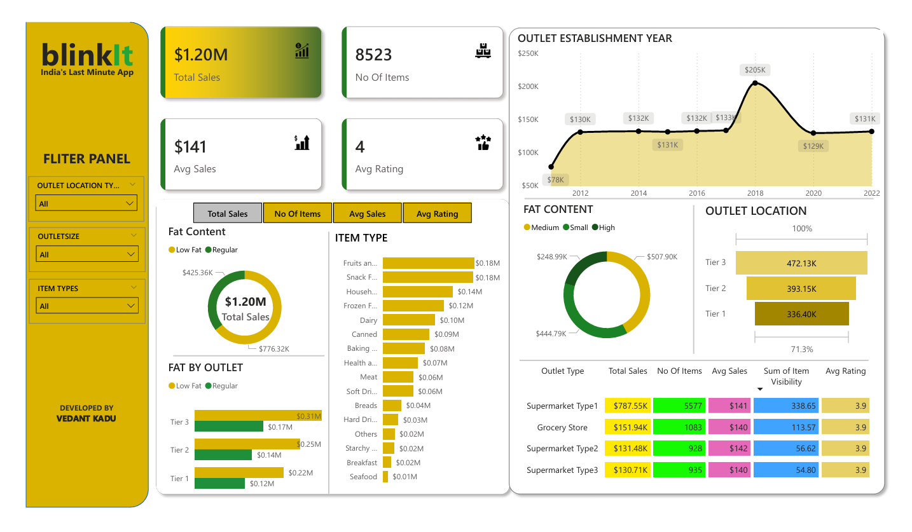

# 📊 Blinkit Sales Dashboard – Power BI Project

This Power BI project analyzes the sales and delivery performance of Blinkit, one of India's leading instant delivery platforms.

---

## 🚀 Project Overview

This interactive dashboard provides deep insights into:
- Top-performing cities and delivery zones
- Revenue distribution
- Hourly and daily sales trends
- Delivery efficiency metrics

Built using:
- **Power BI Desktop**
- Custom visuals and filters
- Data cleaning using Power Query

---

## 📁 Files Included
- `Blinkit_Sales_Dashboard.pbix` – Main Power BI dashboard file
- `sample_dataset.csv` – Cleaned sample dataset (optional)
- `dashboard_screenshot.png` – Visual preview of the dashboard

---

## 🧠 Skills Demonstrated
- Data Cleaning & Shaping in Power Query
- DAX Measures & Calculations
- Report Designing and Visual Storytelling
- Drill-downs, filters, and slicers

---

## 🛠 Tools Used
- Power BI Desktop
- Microsoft Excel (for initial dataset handling)

---

## 📅 Date of Completion
**July 27, 2025**

---

## 🔗 LinkedIn Post
[Check it out on LinkedIn](https://www.linkedin.com/posts/vedantkadu25_powerbi-dataanalytics-dashboarddesign-activity-7355307169702895616-CH2U?utm_source=share&utm_medium=member_desktop)

---

## 📌 Author
**Vedant Kadu**

